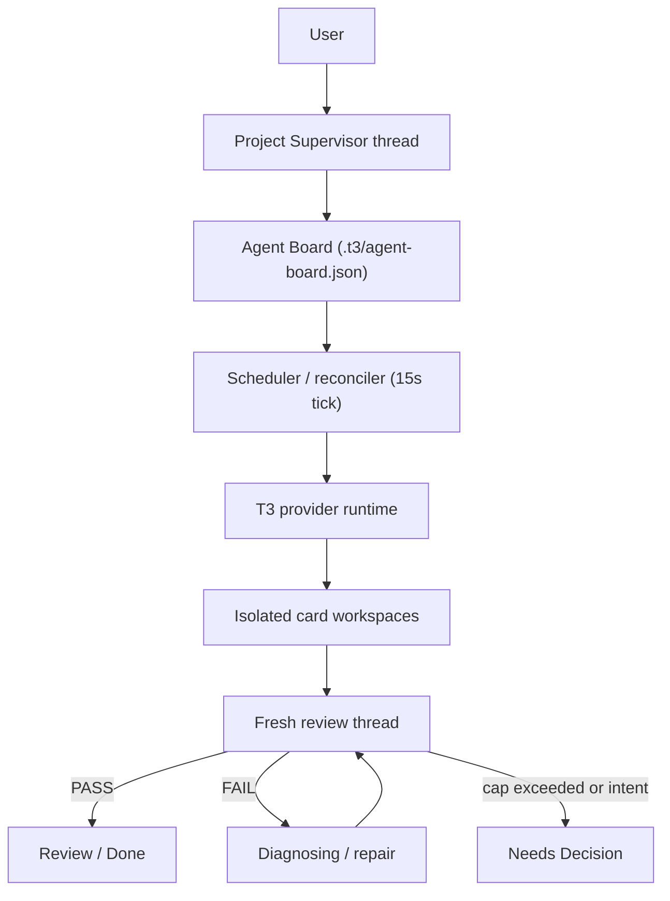
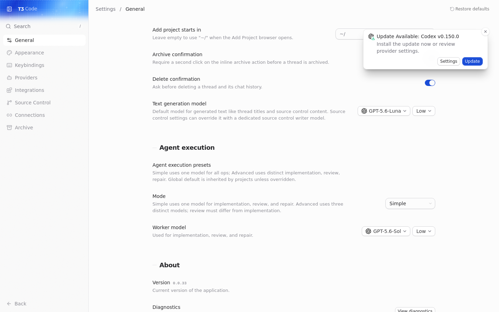

# T3 Code Planning Fork

**T3 Code with project-level orchestration.**

An experimental fork of [T3 Code](https://github.com/pingdotgg/t3code) that keeps the familiar T3 agent experience and adds a Supervisor-first planning workflow inspired by [OpenAI Symphony](https://github.com/openai/symphony). You talk to a project Supervisor, work is tracked on an Agent Board, and an autonomous scheduler launches isolated workers through T3's provider runtime — with independent review and bounded repair cycles.

> **This is not the official T3 Code project.** Upstream T3 Code lives at [pingdotgg/t3code](https://github.com/pingdotgg/t3code). This repository is maintained separately as a planning/orchestration experiment.


## Why this fork exists

Long agent sessions lose context. Plans drift, dependencies get forgotten, and work can be marked done without enough proof.

This fork adds a durable planning layer on top of T3 Code:

- A **Project Supervisor** thread shapes intent and keeps docs in sync.
- An **Agent Board** is the visible proof ledger for what is ready, running, reviewing, or blocked.
- A **scheduler/reconciler** claims `Ready` cards, runs workers in isolated workspaces, and keeps going without the Planning UI open.
- **Independent review** uses a fresh thread (not the implementation conversation) before work moves forward.
- **Bounded repair** retries routine failures, then stops at `Needs Decision` when automation should not guess.

## How it works

The Supervisor is not a separate service. It is a normal T3 project thread — typically titled **Project Supervisor** — guided by [`AGENTS.md`](./AGENTS.md) and [`WORKFLOW.md`](./WORKFLOW.md). The UI can pin it and show a Supervisor badge, but orchestration state lives in `.t3/agent-board.json`, not in chat history.



Card lifecycle (actual board states):

```text
Backlog / Draft → Ready → Running → Reviewing → Review / Done
                              ↓            ↓
                         Diagnosing    Needs Decision
```

## Key features

### Agent Board

Project-local board backed by [`.t3/agent-board.json`](./docs/agents/templates/agent-board.example.json):

- **Kanban**, **Planning table**, and **Execution path** views over the same cards
- Card detail editing: intent, acceptance criteria, constraints, dependencies, area/slice links
- Task records under `docs/agents/tasks/` as the durable workpad per card
- Manual **Run** plus autonomous pickup when cards are `Ready`

### Autonomous scheduler

The server starts a board scheduler automatically (15-second reconciler). It:

- Reconciles `Running`, `Reviewing`, and `Diagnosing` cards before claiming new work
- Creates or reuses isolated workspaces at `.t3/workspaces/<card-id>`
- Dispatches implementation, review, and repair through T3's orchestration layer
- Appends proof to linked task records when possible
- Runs headless — the Planning tab does not need to stay open

### Cross-provider execution

Unlike Symphony's Codex-centric reference implementation, this fork uses **T3's provider abstraction**. The scheduler resolves models from global and project execution presets, then launches whichever provider T3 supports on your machine — for example Codex, Cursor, Claude Code, Grok Build, or OpenCode (including local models via OpenCode/Ollama when configured).

There is no parallel custom provider layer in this fork.

### Simple vs Advanced execution presets

Configure defaults in **Settings → General → Agent execution presets**. Projects can inherit or override.

| Mode         | Behavior                                                   |
| ------------ | ---------------------------------------------------------- |
| **Simple**   | One model selection for implementation, review, and repair |
| **Advanced** | Separate selections for implementation, review, and repair |

In Advanced mode, **review must use a different model than implementation** (same `instanceId` + model is blocked). Repair may reuse the implementation model. These are execution presets, not a separate agent-role system.



### Review and repair loop

After implementation completes:

1. Scheduler opens a **fresh review thread** in the same card workspace
2. Review agent returns `REVIEW: PASS`, `REVIEW: FAIL`, or `NEEDS_DECISION: …`
3. **PASS** → card moves to `Review` (human visibility) with proof appended
4. **FAIL** (routine) → `Diagnosing` → repair turn on the implementation thread → new review
5. Repair cycles cap at `runner.repairCycles` (default **3**) → `Needs Decision` with a summary
6. Intent or credential questions → `Needs Decision` immediately

## Visual walkthrough

**Kanban** — primary control surface for card states and manual Run:


**Planning table** — dense grouping by area and slice:


**Execution path** — dependency tiers and sequencing (same board data):


## Getting started

### Requirements

- Node.js `^24.13.1` (see upstream [install docs](./docs/user/install.md))
- At least one provider CLI installed and authenticated (Codex, Claude, Cursor, OpenCode, …)
- [Vite+](https://viteplus.dev/guide/) (`vp`) — the repo package manager and task runner

### Clone and run this fork

Keep this checkout separate from a normal T3 Code install:

```bash
git clone https://github.com/leonaaardob/t3code-planning-fork.git
cd t3code-planning-fork
vp i
vp run dev
```

Read the `[dev-runner]` line in the terminal for the actual **server port**, **web port**, and **pairing URL**. Open the full pairing URL (including `#token=…`) in your browser before using the UI.

Runtime state defaults to this worktree's gitignored `.t3/` directory.

### Using upstream T3 instead

If you only want stock T3 Code without planning:

```bash
npx t3@latest
```

See [docs/user/install.md](./docs/user/install.md) for desktop packages and provider setup.

### Provider setup (same as upstream)

Install and log in to the CLIs you plan to use on the **machine running the server**:

| Provider | Login                 |
| -------- | --------------------- |
| Codex    | `codex login`         |
| Claude   | `claude auth login`   |
| Cursor   | `agent login`         |
| OpenCode | `opencode auth login` |

Enable additional providers under **Settings → Providers** when needed.

## Configuration

| What                     | Where                                                       |
| ------------------------ | ----------------------------------------------------------- |
| Global execution presets | Settings → General → Agent execution presets                |
| Project override         | Project settings → Agent execution (inherit or override)    |
| Board file               | `.t3/agent-board.json` (per project; gitignored by default) |
| Workflow contract        | [`WORKFLOW.md`](./WORKFLOW.md)                              |
| Supervisor rules         | [`AGENTS.md`](./AGENTS.md)                                  |
| Patch / integration map  | [`PATCH.md`](./PATCH.md)                                    |

Example board shape: [`docs/agents/templates/agent-board.example.json`](./docs/agents/templates/agent-board.example.json)

## Remote and headless usage

Planning features follow T3 Code's remote model: run the server on a host with provider credentials, pair from another device, and use the same board/scheduler behavior. See [docs/user/remote-access.md](./docs/user/remote-access.md).

The scheduler runs server-side, so autonomous `Ready` → worker → review loops do not require the Planning UI to remain open.

## Project status

- **Upstream sync:** this fork tracks [T3 Code v0.0.34](https://github.com/pingdotgg/t3code/releases).
- **Experimental:** expect breakage when upstream changes routing, RPC, chat layout, or provider orchestration. Start repairs from [`PATCH.md`](./PATCH.md).
- **Validated in this phase:** cross-provider execution, autonomous scheduler/reconciler, independent review/repair, and Advanced A/B execution presets (review model ≠ implementation model).
- **Not production-ready:** workflow front-matter validation, hook execution, and some Symphony parity items remain backlog (see [`docs/agents/symphony-conformance.md`](./docs/agents/symphony-conformance.md)).

Use the header **Break** control to disable Planning UI at runtime if a board view misbehaves during an active session (`t3code.planningFeaturesDisabled` in browser storage).

## Relationship to upstream T3 Code

|               | Upstream T3 Code                                            | This fork                                       |
| ------------- | ----------------------------------------------------------- | ----------------------------------------------- |
| Maintainer    | [T3 Tools / pingdotgg](https://github.com/pingdotgg/t3code) | Community fork                                  |
| Focus         | Multi-surface agent GUI                                     | + Agent Board, scheduler, Supervisor workflow   |
| Orchestration | Per-thread turns                                            | + project board, workspaces, review/repair loop |
| License       | MIT                                                         | MIT (same; see [LICENSE](./LICENSE))            |

Sync upstream with:

```bash
git fetch upstream --prune
git log --oneline main..upstream/main
```

Do not push planning changes to upstream unless you are contributing through their process.

## Symphony inspiration

[OpenAI Symphony](https://github.com/openai/symphony) explores long-running, repository-owned agent orchestration: tracked work items, isolated workspaces, autonomous scheduling, reconciliation, bounded retries, and durable state outside chat.

**OpenAI did not build or endorse this fork.** We borrowed the _shape_ of that workflow and mapped it onto T3 Code:

| Symphony reference    | This fork                                                                                                       |
| --------------------- | --------------------------------------------------------------------------------------------------------------- |
| Linear issues         | `.t3/agent-board.json` cards                                                                                    |
| Codex-centric workers | T3 provider-neutral runtime                                                                                     |
| WORKFLOW.md policy    | [`WORKFLOW.md`](./WORKFLOW.md) + [`docs/agents/symphony-conformance.md`](./docs/agents/symphony-conformance.md) |

## Known limitations

- No official T3 plugin system — this is a modified fork, not a drop-in extension.
- GitHub Actions workflows are omitted from this public repository (publish token lacked `workflow` scope).
- `.t3/` runtime data, workspaces, and local board state are gitignored — seed from the example template.
- Typed `WORKFLOW.md` front-matter validation and hook execution are not implemented yet.
- A generic Cursor ACP fix for composite model slugs (e.g. `gemini-3.7-flash-high`) lives on `main` for validation; upstream may absorb it separately — it is not planning-specific.

## Documentation

- Planning workflow: [`WORKFLOW.md`](./WORKFLOW.md), [`docs/agents/project-master-plan.md`](./docs/agents/project-master-plan.md)
- Templates: [`docs/agents/templates/`](./docs/agents/templates/)
- User docs (upstream): [`docs/user/`](./docs/user/)
- Internals: [`docs/internals/overview.md`](./docs/internals/overview.md)

## Contributing

Read [CONTRIBUTING.md](./CONTRIBUTING.md). Feature ideas for **upstream** T3 Code belong in [their Ideas discussions](https://github.com/pingdotgg/t3code/discussions/categories/ideas). For this fork, open issues or PRs here.

When changing planning behavior, update [`PATCH.md`](./PATCH.md) in the same change.

## Credits

- [T3 Code](https://github.com/pingdotgg/t3code) by [T3 Tools](https://t3.gg) — upstream GUI, server, and provider stack (MIT).
- [OpenAI Symphony](https://github.com/openai/symphony) — conceptual inspiration for tracked work, workspaces, and autonomous scheduling (not affiliated).
- Planning fork maintenance: [leonaaardob/t3code-planning-fork](https://github.com/leonaaardob/t3code-planning-fork).

## License

MIT — see [LICENSE](./LICENSE). Copyright (c) 2026 T3 Tools Inc. This fork remains under the upstream license; attribution to T3 Code is required when redistributing.
