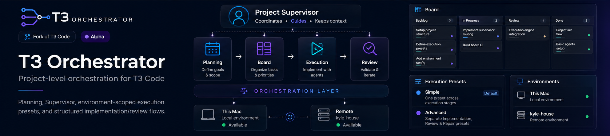
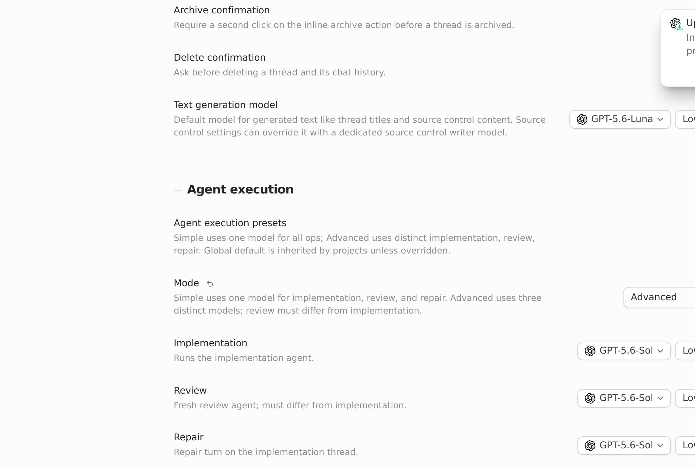

# T3 Orchestrator

<p align="center">
  
</p>

**Project-level orchestration for [T3 Code](https://github.com/pingdotgg/t3code).**

T3 Orchestrator is a fork of T3 Code and keeps T3 Code as its technical foundation. It is not an official T3 Code feature or plugin.

The planning/orchestration layer started from ideas and implementation work in [RyHale/t3code-planning-fork](https://github.com/RyHale/t3code-planning-fork). T3 Orchestrator has since extended that layer substantially — for example Project Supervisor, Simple / Advanced execution presets, Implementation / Review / Repair flows, and environment-scoped orchestration across local and remote environments.

**Status: Alpha.** Useful for side-projects and experiments. Not a turnkey production orchestration system.

> This is not the official T3 Code project. Upstream technical foundation: [pingdotgg/t3code](https://github.com/pingdotgg/t3code). Planning/orchestration lineage: [RyHale/t3code-planning-fork](https://github.com/RyHale/t3code-planning-fork). Conceptual inspiration (separate): [OpenAI Symphony](https://github.com/openai/symphony) — not affiliated with OpenAI.

---

## Why this fork?

Coding agents are useful one session at a time. Real project work needs more structure around them:

```text
planning → tasks → implementation → independent review → repair → human decisions
```

…plus durable project context that survives longer than a single chat thread.

T3 Orchestrator builds on that planning lineage on top of T3 Code: a visible board, execution presets, an independent review step, and a designated **Project Supervisor** thread for planning context.

Separately, the orchestration approach is inspired in part by OpenAI Symphony. This project adapts those ideas pragmatically for an interactive desktop / side-project workflow. It is not endorsed by OpenAI and does not claim Symphony compatibility certification.

I currently use T3 Orchestrator for my side-projects. It is not yet the orchestration system I use for production work.

A private orchestrator can be optimized around one specific way of building software. A public one needs to work across many different repositories, stacks, and workflows — so this layer stays deliberately basic and evolves more slowly.

Feedback, bug reports, and contributions are welcome.

---

## Key features

### Planning & Board

A project-level planning surface (Kanban, Planning table, Execution path) backed by real work cards.

<p align="center">
  
</p>

### Project Supervisor

A designated project thread that helps maintain project context and guide planning. It is a normal T3 thread — pinned and badged — not a separate autonomous orchestration service.

<p align="center">
  
</p>

### Structured execution loop

```text
Implementation
→ Review          (separate thread / selection)
→ Repair when needed
→ Human decision
```

Review runs separately from Implementation. A successful automated review moves the card to **Review** — it does **not** auto-complete the work. You decide when it is **Done**.

### Simple presets

One execution preset across stages: the same provider/model selection for implementation, review, and repair.

### Advanced presets

Separate Implementation, Review, and Repair presets. In Advanced mode, Implementation and Review must use different `(provider, model)` selections.

<p align="center">
  
</p>

### Environment-scoped orchestration

Each environment (for example **Local environment**, or a paired remote machine) has its own providers, models, and orchestration defaults. A project runs on the environment that owns it.

Configure defaults in **Settings → Orchestration**. Projects can inherit those defaults or override them.

### Local + remote projects

Start local. Pairing a remote environment so projects, files, and providers live on another machine is an advanced capability — not required for your first run.

---

## Quick start

1. Download **T3 Orchestrator** from [GitHub Releases](https://github.com/leonaaardob/t3-orchestrator/releases)
2. Launch it
3. Configure a coding provider (**Settings → Providers**)
4. Add a project (**Add project**)
5. Configure an Orchestration preset (**Settings → Orchestration**)
6. Open **Planning**
7. Create a card, move it to **Ready**, and run it
8. Inspect the result when it reaches **Review** — then mark **Done** yourself when you accept the work

**New to T3 Code or agent orchestration?** Follow the full guide: **[Getting Started](./docs/getting-started.md)**.

---

## Desktop downloads

Packaged builds are on [GitHub Releases](https://github.com/leonaaardob/t3-orchestrator/releases).

| Platform            | Asset pattern                                  |
| ------------------- | ---------------------------------------------- |
| macOS Intel         | `T3-Orchestrator-<version>-x64.dmg` / `.zip`   |
| macOS Apple Silicon | `T3-Orchestrator-<version>-arm64.dmg` / `.zip` |
| Windows x64         | `T3-Orchestrator-<version>-x64.exe`            |
| Windows ARM64       | `T3-Orchestrator-<version>-arm64.exe`          |
| Linux x64           | `T3-Orchestrator-<version>-x86_64.AppImage`    |
| Linux ARM64         | `T3-Orchestrator-<version>-arm64.AppImage`     |

**macOS:** public builds are currently unsigned. macOS may require manual approval through Gatekeeper. Updates currently use a manual DMG install flow.

**Windows:** unsigned builds may trigger SmartScreen.

Do not disable system-wide Gatekeeper or SmartScreen. Detailed first-open steps are in [Getting Started](./docs/getting-started.md).

---

## How orchestration works

At a high level:

```text
You shape work on the Board
        ↓
Ready cards are picked up for Implementation
        ↓
A separate Review pass inspects the result
        ↓
PASS → card enters Review (human gate)
FAIL → Repair (bounded) → Review again
or → Needs Decision
```

You stay responsible for accepting work. Automated **REVIEW: PASS** means the card is ready for your inspection — not that the product decided it is finished.

---

## Who it's for

- Developers already using coding-agent tools
- Indie hackers and side-project builders
- People who want a structured implementation / review loop
- People who want a visible planning board around agents
- Users comfortable experimenting with alpha developer tools
- Users who may work across local and remote machines

## Who it's not for

- Non-technical project management
- Turnkey production orchestration
- Enterprise governance / compliance tooling
- Distributed stage-by-stage worker scheduling across machines
- Fully autonomous ship-to-production workflows
- Anyone expecting agents to auto-mark reviewed work as **Done**

---

## Current limitations

- **Alpha** — APIs, UI, and orchestration behavior may change
- Project execution is bound to **one environment**
- No cross-environment Implementation / Review routing
- No automatic workspace synchronization between environments
- Supervisor is a designated thread, not a separate autonomous service
- Human approval remains after successful Review
- Repair cycles are bounded and can end in **Needs Decision**
- Provider / model must exist on the project’s environment
- Offline remote environments cannot execute their projects
- macOS and Windows builds are currently **unsigned**
- Some Symphony-style workflow validation / features are not implemented yet

---

## Contributing

Feedback and contributions are welcome. See [CONTRIBUTING.md](./CONTRIBUTING.md).

Please keep changes scoped. Discuss large ideas before opening a big PR. Do not submit T3 Orchestrator-specific orchestration changes to upstream T3 Code unless they are independently relevant there.

---

## Upstream

T3 Orchestrator is built on top of [T3 Code](https://github.com/pingdotgg/t3code). That repository remains the upstream technical foundation (desktop/runtime GUI, server, providers). This project is a fork of T3 Code and is **not** the official T3 Code project.

## Planning & orchestration lineage

The planning/orchestration layer originally grew from [RyHale/t3code-planning-fork](https://github.com/RyHale/t3code-planning-fork) and has since been substantially extended inside T3 Orchestrator. Credit that fork for the planning starting point — not as the upstream T3 Code parent.

## Inspiration

[OpenAI Symphony](https://github.com/openai/symphony) is conceptual inspiration for tracked work, isolated workspaces, and structured agent loops. That relationship is separate from both the T3 Code upstream and the RyHale planning lineage. Not affiliated with OpenAI.

Maintained at [leonaaardob/t3-orchestrator](https://github.com/leonaaardob/t3-orchestrator).

---

## License

MIT — see [LICENSE](./LICENSE). Copyright (c) 2026 T3 Tools Inc. This fork remains under the upstream license; attribution to T3 Code is required when redistributing.
